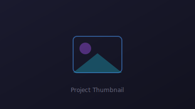

# AR/VR/MR/XR Portfolio Website

A premium, fully responsive portfolio website for an **AR/VR/MR/XR & Spatial Computing Engineer**. Built with pure HTML5, CSS3, and Vanilla JavaScript — no frameworks, no build step.

Inspired by Apple Vision Pro and Meta Quest aesthetics with glassmorphism, neon accents, smooth animations, and a mobile-first responsive layout.



## Features

- **Futuristic dark theme** with light mode toggle
- **Glassmorphism** UI with neon blue/purple gradient accents
- **Animated particle background** (Canvas API)
- **Loading screen** with smooth fade-out
- **Scroll progress bar** and back-to-top button
- **Typing effect** for professional titles
- **Scroll-triggered animations** via Intersection Observer API
- **Dynamic project cards** rendered from `js/projects.js`
- **Technologies carousel** with infinite scroll
- **Gallery lightbox** for image previews
- **Lazy-loaded images** with SVG fallbacks
- **SEO optimized** with meta tags, Open Graph, and JSON-LD structured data
- **Accessible** with ARIA labels, skip links, keyboard navigation, and reduced-motion support

## Project Structure

```
PF3/
├── index.html                  # Root redirect to html/index.html
├── html/
│   └── index.html              # Main portfolio page
├── css/
│   ├── main.css                # Core styles, layout, components
│   ├── animations.css          # Keyframes & scroll animations
│   └── responsive.css          # Mobile-first breakpoints
├── js/
│   ├── projects.js             # Project data array (edit here!)
│   ├── particles.js            # Canvas particle system
│   └── main.js                 # UI logic & interactions
├── images/
│   ├── profile.jpg             # Your profile photo (replace)
│   ├── profile-placeholder.svg # Fallback avatar
│   ├── placeholder-project.svg # Fallback project thumbnail
│   ├── placeholder-gallery.svg # Fallback gallery image
│   ├── projects/               # Project thumbnails
│   ├── gallery/                # Gallery images
│   └── videos/                 # Video thumbnails
├── assets/
│   ├── favicon.svg
│   └── cv-placeholder.pdf      # Replace with your CV
├── documentation/
│   └── DEPLOYMENT.md           # Detailed deployment guide
└── README.md
```

## Quick Start

### 1. Clone or download

```bash
git clone https://github.com/yourusername/your-portfolio.git
cd your-portfolio
```

### 2. Customize your content

| What to update | Where |
|---|---|
| Name, title, bio, links | `html/index.html` |
| Projects (title, links, tech) | `js/projects.js` |
| Profile photo | `images/profile.jpg` |
| CV download | `assets/cv-placeholder.pdf` |
| Gallery images | `images/gallery/` |
| Project thumbnails | `images/projects/` |
| YouTube video IDs | `html/index.html` (Videos section) |
| SEO meta tags | `html/index.html` `<head>` |

### 3. Preview locally

Open `html/index.html` in your browser, or use a local server:

```bash
# Python
python -m http.server 8000

# Node.js (npx)
npx serve .

# Then visit http://localhost:8000/html/
```

### 4. Deploy to GitHub Pages

See [documentation/DEPLOYMENT.md](documentation/DEPLOYMENT.md) for full instructions.

**Quick deploy:**

1. Push the repo to GitHub
2. Go to **Settings → Pages**
3. Set source to **Deploy from branch → main → / (root)**
4. The root `index.html` redirects to `html/index.html`

## Updating Projects

Edit `js/projects.js` — no HTML changes needed:

```javascript
{
  id: 7,
  title: "My New XR Project",
  description: "Short project description...",
  thumbnail: "../images/projects/my-project.jpg",
  technologies: ["Unity", "OpenXR", "C#"],
  githubUrl: "https://github.com/yourusername/project",
  demoUrl: "https://your-demo.com",
  videoUrl: "https://drive.google.com/file/d/YOUR_VIDEO_ID/view"
}
```

## Sections

| Section | Description |
|---|---|
| Hero | Profile photo, name, typing title, action buttons |
| About | Bio and key statistics |
| Skills | AR/VR, AI, Programming, 3D, Tools |
| Projects | Dynamic cards from `projects.js` |
| Experience | Timeline of work history |
| Education | Academic background |
| Certifications | Professional credentials |
| Research | Publications and papers |
| Gallery | Image grid with lightbox |
| Technologies | Infinite scrolling carousel |
| Videos | YouTube embed on click |
| Contact | Info + form |
| Footer | Social links and copyright |

## Browser Support

- Chrome 90+
- Firefox 88+
- Safari 14+
- Edge 90+
- Mobile browsers (iOS Safari, Chrome Android)

## Performance

- No external JS frameworks
- Google Fonts with `preconnect`
- Lazy-loaded images (`loading="lazy"`)
- CSS custom properties for theming
- Reduced motion media query support
- Minimal DOM manipulation

## License

This project is open source and available for personal portfolio use. Replace all placeholder content with your own information before publishing.

## Author

**Your Name** — AR/VR/MR/XR & Spatial Computing Engineer

- GitHub: [@yourusername](https://github.com/yourusername)
- LinkedIn: [yourusername](https://linkedin.com/in/yourusername)
- Email: your.email@example.com
